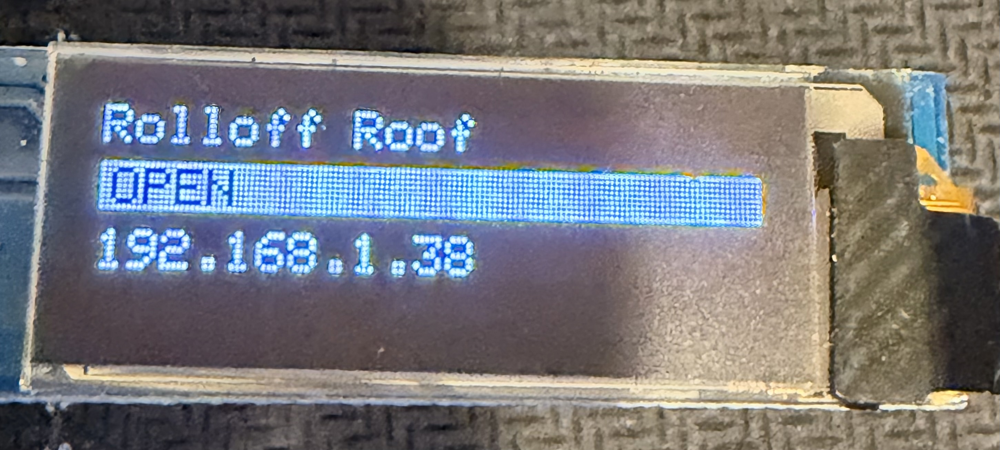
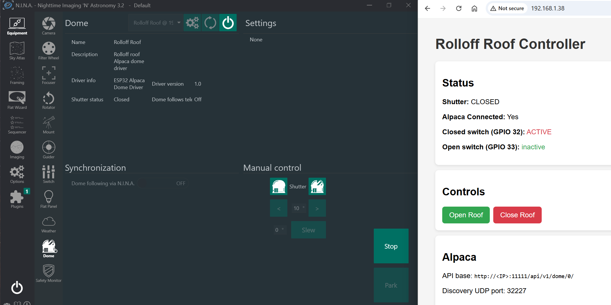

# ESP32 Rolloff Roof — ASCOM Alpaca Driver

An ESP32-based controller for a rolloff observatory roof. Implements the [ASCOM Alpaca](https://ascom-standards.org/Developer/Alpaca.htm) Dome interface so any Alpaca-compatible astronomy application (N.I.N.A., Cartes du Ciel, etc.) can open, close, and monitor the roof. A built-in web page provides manual control from any browser on the local network.




---

## Features

- ASCOM Alpaca Dome driver (interface version 3) on port **11111**
- Alpaca UDP auto-discovery on port **32227** — no manual IP entry needed in N.I.N.A.
- Browser control/status page on port **80** (auto-refreshes every 3 s)
- 0.91″ SSD1306 OLED showing shutter status and IP address
- Two limit switches (OPEN and CLOSED positions)
- Relay pulse (250 ms) to toggle the motor controller
- 2-minute movement watchdog — sets error state if a limit switch is never reached
- WiFi credentials kept in a gitignored file — safe to push to GitHub

---

## Hardware

| Part | Description |
|------|-------------|
| ESP32 DevKit-C | 38-pin, USB-C (ESP32-WROOM-32) |
| OLED display | 0.91″ SSD1306 I2C 128×32, address 0x3C |
| Limit switch ×2 | Normally-open (NO) momentary switches |
| Relay module | Single-channel, triggered by a logic-HIGH pulse |

---

## Wiring

### ESP32 DevKit-C pin layout (USB-C end at top)

```
LEFT SIDE                              RIGHT SIDE
─────────────────────────────────      ─────────────────────────────
3V3   ── OLED VCC                      VIN
GND   ── OLED GND                      GND  ── switch common (both)
D15                                    D13
D2                                     D12
D4                                     D14
RX2                                    D27
TX2                                    D26
D5                                     D25
D18 (GPIO18) ── Relay signal           D33 (GPIO33) ── Limit sw OPEN
D19 (GPIO19) ── OLED SCK ┐ adjacent   D32 (GPIO32) ── Limit sw CLOSED
D21 (GPIO21) ── OLED SDA ┘            D35
RX0                                    D34
TX0                                    VN
D22                                    VP
D23                                    EN
GND
```

### Connection summary

| ESP32 pin | Signal | Notes |
|-----------|--------|-------|
| GPIO 32 (D32) | Limit switch — CLOSED | Pull-up enabled; switch other terminal → GND |
| GPIO 33 (D33) | Limit switch — OPEN   | Pull-up enabled; switch other terminal → GND |
| GPIO 18 (D18) | Relay signal | Pulses HIGH for 250 ms |
| GPIO 19 (D19) | OLED SCK (I2C clock) | Adjacent pair on board |
| GPIO 21 (D21) | OLED SDA (I2C data)  | Adjacent pair on board |
| 3V3 | OLED VCC | |
| GND | OLED GND, switch common | |

The two limit-switch GPIOs (D32/D33) are adjacent on the right rail; the two OLED signal pins (D19/D21) are adjacent on the left rail.

---

## Software setup

### 1. Clone the repository

```bash
git clone https://github.com/<your-user>/ESP32-Rolloff.git
cd ESP32-Rolloff
```

### 2. Create your WiFi credentials file

```bash
cp include/wifi_credentials.h.example include/wifi_credentials.h
```

Edit `include/wifi_credentials.h` and fill in your SSID and password:

```cpp
#define WIFI_SSID "YourSSID"
#define WIFI_PASS "YourPassword"
```

`wifi_credentials.h` is listed in `.gitignore` and will never be committed.

### 3. Build and flash

Open the project in [PlatformIO](https://platformio.org/) (VS Code extension or CLI) and upload:

```bash
pio run --target upload
```

Required libraries (installed automatically by PlatformIO via `platformio.ini`):

- `adafruit/Adafruit SSD1306`
- `adafruit/Adafruit GFX Library`

---

## Usage

### Browser

Open `http://<ESP32-IP>/` in any browser on the same network. The page shows shutter status, switch states, and Open / Close buttons. It auto-refreshes every 3 seconds.

### ASCOM Alpaca (N.I.N.A., Cartes du Ciel, etc.)

The device advertises itself via Alpaca UDP discovery — most clients will find it automatically. If you need to enter it manually:

| Setting | Value |
|---------|-------|
| IP address | assigned by your router (shown on OLED) |
| Alpaca port | 11111 |
| Device type | Dome |
| Device number | 0 |

### Serial monitor

Connect at **115200 baud** to see startup messages including the assigned IP address.

---

## OLED display

```
┌──────────────────────┐
│ Rolloff Roof         │   ← title
│ ▓▓▓▓OPEN▓▓▓▓▓▓▓▓▓▓▓  │   ← status on white bar (OPEN/CLOSED/OPENING/CLOSING/ERROR)
│ 192.168.1.38         │   ← IP address
└──────────────────────┘
```

---

## Ports

| Port | Protocol | Purpose |
|------|----------|---------|
| 80 | TCP/HTTP | Browser status + control page |
| 11111 | TCP/HTTP | ASCOM Alpaca Dome API |
| 32227 | UDP | Alpaca auto-discovery |

---

## GPIO summary

| GPIO | Direction | Function |
|------|-----------|---------|
| 18 | Output | Relay pulse (HIGH = active) |
| 19 | Output | OLED SCL (I2C clock) |
| 21 | I/O | OLED SDA (I2C data) |
| 32 | Input | Limit switch CLOSED (active LOW) |
| 33 | Input | Limit switch OPEN (active LOW) |
